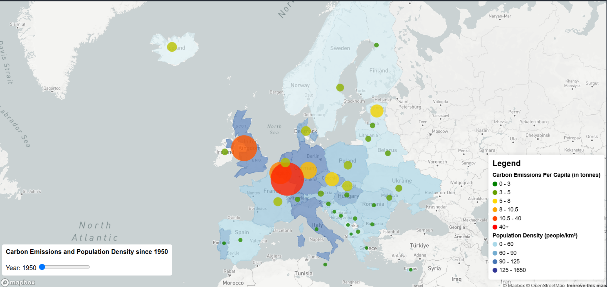
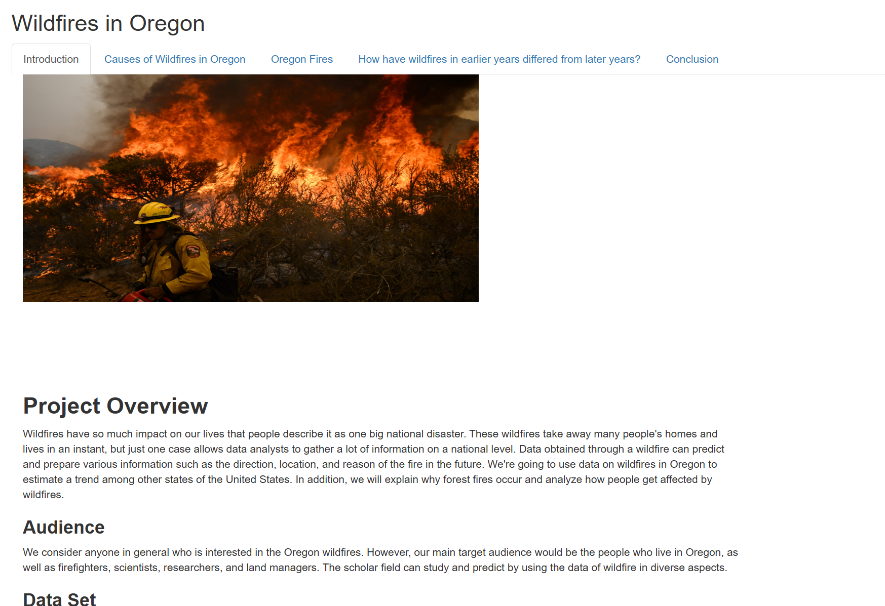

# Simran Bhatti – Climate & GIS Data Projects

Hello! My name is Simran and I'm a recent Geography–Data Science graduate from the University of Washington. I specialized multiple programs within GIS and data science like R, QGIS, ArcGIS Online, and Web GIS. My projects span climate change mapping, carbon emissions tracking, and historical migration analysis. Here's a selection of my academic and personal projects.

## 🔍 Featured Projects

### 1. Web GIS: Tracking Carbon Emissions in Europe

- Built with HTML, JavaScript, and SQL.
- Interactive time slider, emissions intensity gradients, and popups.
- Designed for public and policymaker engagement.

[Link to project website](https://jordanchiang627.github.io/Geog328_FinalProject/)

[Link to project github](https://github.com/simmi333/Geog328_FinalProject.git)

### 2. Mapping Climate Change with QGIS

- Compared historical vs. projected temperatures data across the U.S.
- Used raster datasets, interpolation, and custom symbology.
- Designed inset maps to highlight regional climate impacts.

### 3. Ferry Ridership Flow Visualization (Python)

- Processed WSDOT data to create a Sankey diagram.
- Analyzed ridership trends and flow patterns.

In this project, our group created a Sankey diagram to visualize ferry ridership flows across the Puget Sound region using 2023 data from the Washington State Department of Transportation (WSDOT). The objective was to explore how spatial data can tell stories about movement and connection. We focused on routes within the Washington State Ferries system, the largest ferry system in the U.S., and transformed raw ridership numbers into a more intuitive visual format.

This project focuses on the Seattle metropolitan area and surrounding waters, where ferries are a central part of daily transportation. The Washington State Ferries system includes 13 key routes that connect cities and islands across the Puget Sound.

The Sankey diagram presents ferry routes as flows, with origin points on the left and destination points on the right. The width of each flow corresponds to the total number of passengers, allowing for an immediate visual comparison between routes.

We used three variables:

- Source: Ferry terminal of departure
- Target: Destination terminal
- Value: Number of riders

Data collected from: Washington State Ferries Traffic Statistics Rider Segment Report 
https://wsdot.wa.gov/sites/default/files/2024-01/WashingtonStateFerries-TrafficStatistics-2023Annual.pdf

### 4. Wildfires in Oregon (R)

Link to Shiny App: http://127.0.0.1:5527/

### 5. Experience in Generative AI Tools

As part of the University of Washington’s Web GIS course, GEOG 328, taught by Dr. Bo Zhao, I explored the integration of generative AI—specifically ChatGPT—into the design and development of web-based geographic information systems. This approach enhanced productivity, simplified error analysis, and accelerated the learning curve for front-end development and spatial data handling.

We worked AI tools like  ChatGPT and Copilot, and comapred them to eachother.

https://github.com/jakobzhao/geog328

### 6. Storymap of Bristih India Partition (ArcGIS Online)

- Story Map of the India/Pakistan/Bangladesh Partitions
- Shows how borders affected South Asia
- Use of overlying historical maps on modern ones

Link:
https://storymaps.arcgis.com/stories/c3329ef58d574ae6a680a25ed86ff879

## 🧠 Skills
Python, JavaScript, QGIS, ArcGIS, R, PostgreSQL, Web GIS, Generative AI tools, Excel
