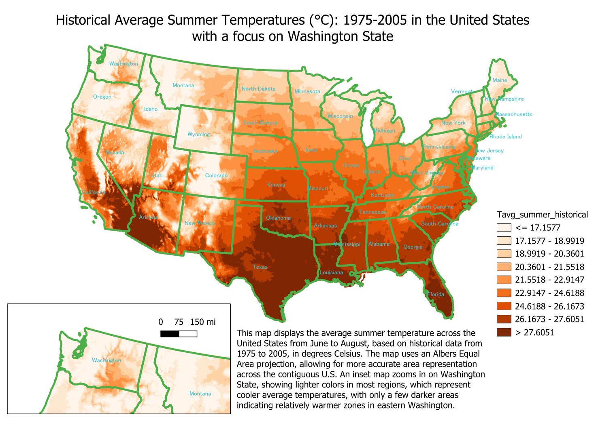
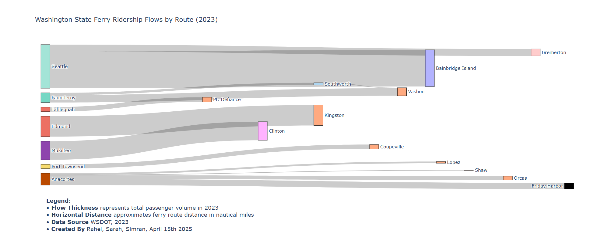

# Simran Bhatti – Climate & GIS Data Projects

Hello! My name is Simran and I'm a recent Geography–Data Science graduate from the University of Washington. I specialized multiple programs within GIS and data science like R, QGIS, ArcGIS Online, and Web GIS. My projects span climate change mapping, carbon emissions tracking, and historical migration analysis. Here's a selection of my academic and personal projects.

## 🔍 Featured Projects

### 1. Mapping Climate Change with QGIS
- Compared historical vs. projected precipitation data across the U.S.
- Used raster datasets, interpolation, and custom symbology.
- Designed inset maps to highlight regional climate impacts.

### 2. Ferry Ridership Flow Visualization (Python)
- Processed WSDOT data to create a Sankey diagram.
- Analyzed ridership trends and flow patterns.

### 3. Web GIS: Tracking Carbon Emissions in Europe
- Built with HTML, JavaScript, and SQL.
- Interactive time slider, emissions intensity gradients, and popups.
- Designed for public and policymaker engagement.

## 🧠 Skills
Python, JavaScript, QGIS, R, PostgreSQL, Web GIS, Generative AI tools
